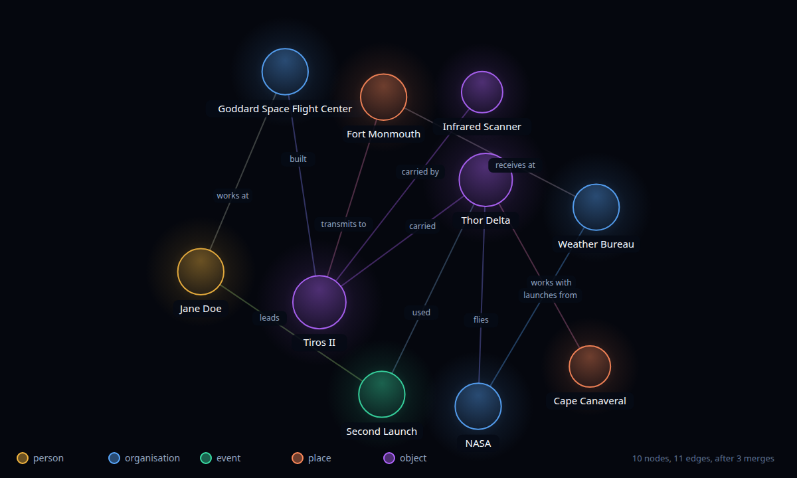

# @radost-it/trace-graph

Incremental knowledge-graph core. You pass in entities and relations named by
**label**. It assigns stable ids, merges them into a running snapshot,
recomputes degree centrality and Louvain communities, and caps the snapshot to
a size you choose.

No DOM, no Web APIs, no native modules. It runs in Node, in a browser, and on
Hermes (React Native / Fire TV Vega OS).

Extracted from [Trace](https://github.com/Radost-IT/trace), which builds a live
graph from a broadcast's audio.



The picture comes from a real snapshot. `node docs/make-graph-image.mjs` runs
three extractions through `mergeExtraction` and writes `docs/graph.svg`.
`docs/graph.png` is a render of that file. Layout and colours live in the
script, not in the package.

## Install

```bash
npm install @radost-it/trace-graph
```

Node >= 22 for server-side use. `zod` v4 is a regular dependency, not a peer.
The exported schemas are zod schemas you can compose with your own.

## Why

Building a graph from a stream of extractions needs some bookkeeping:

- `"Dr. Jane Doe"`, `"Jane Doe"` and `"jane doe"` must end up on one node.
- Relations name entities by label, not by id.
- One new edge can change centrality and communities for distant nodes, so
  they are recomputed, not patched.
- The snapshot must stay small enough to store and draw.
- Merging the same input twice must give the same graph.
- Entities with no relation add nothing to the drawing.
- Relation labels like `"is being assembled at"` are too long for an edge.

## Usage

```ts
import { emptySnapshot, mergeExtraction } from "@radost-it/trace-graph";

let snapshot = emptySnapshot("session-1");

snapshot = mergeExtraction(
  snapshot,
  {
    entities: [
      { label: "Dr. Jane Doe", type: "person", summary: "Leads the mission team." },
      { label: "Goddard Space Flight Center", type: "organisation", summary: "Runs the programme." },
    ],
    relations: [{ source: "Jane Doe", target: "Goddard Space Flight Center", label: "leads" }],
  },
  new Date().toISOString(),
  { maxNodes: 60 },
);

snapshot.nodes[0];
// {
//   id: "person:jane-doe",       // honorific stripped, slugified
//   type: "person",
//   label: "Jane Doe",
//   summary: "Leads the mission team.",
//   degree: 1,                    // recomputed across the whole snapshot
//   community: 0,                 // Louvain
//   firstSeenAt: "2026-09-19T..." // set once, never overwritten
// }
```

The relation says `"Jane Doe"` and the entity says `"Dr. Jane Doe"`. Both
normalise to the same id, so the edge connects.

If the extraction comes from an untrusted source such as a model's JSON output,
validate it first with `ExtractionResult.parse(...)`. `mergeExtraction` only
validates what it returns.

## API

| Export | What it does |
| --- | --- |
| `mergeExtraction(snapshot, extraction, seenAt, options?)` | Merges one extraction into a snapshot. Pure and deterministic. Returns a new snapshot, validated with zod. Throws if `seenAt` is not an ISO datetime. |
| `emptySnapshot(sessionId)` | A snapshot with no nodes or edges. |
| `entityId(type, label)` | The stable id for an entity. `("person", "Dr. Jane Doe")` → `"person:jane-doe"`. |
| `normaliseLabel(label)` | Strips one leading honorific and collapses whitespace. |
| `applyMetrics(nodes, edges)` | Returns nodes with `degree` and `community` recomputed. |
| `dropIsolated(nodes, edges)` | Returns only the nodes an edge reaches. |
| `shortenRelation(label)` | The label an edge should carry. `"is being assembled at"` → `"assembled at"`. `""` means drop the relation. |
| `capNodes(nodes, edges, maxNodes)` | Drops the least connected nodes and any edge left dangling. |
| `DEFAULT_MAX_NODES` | `60`. |
| `GraphNode`, `GraphEdge`, `GraphSnapshot`, `EntityType`, `ExtractionResult` | zod schemas, each with an inferred TypeScript type of the same name. |

### Entity types

`EntityType` is a closed set of five, small enough for one colour legend.

| Type | What it holds |
| --- | --- |
| `person` | A named human. |
| `organisation` | A company, agency, government body, armed service, team or programme. |
| `place` | A named location - a country, a city, a site, a base, a facility. |
| `event` | A named happening - a launch, a summit, a strike, a war. |
| `object` | A named made thing - a spacecraft, a ship, an aircraft, an instrument, a class of hardware. |

The thing is the `object`. Whoever built or operates it is the
`organisation`. Type is part of
the id, so `Thor Delta` the rocket and `Thor Delta` the programme stay two
nodes.

### Merge rules

- **Ids come from content.** `entityId` lowercases, strips one leading
  honorific and slugifies. The same label always gives the same id, so merges
  are idempotent across processes and restarts.
- **Relations resolve by label.** An endpoint is matched by its normalised,
  lowercased label, not by type. If two entities of different types share a
  label, the one merged last wins.
- **The first non-empty summary wins.** Later summaries are ignored.
- **`firstSeenAt` is written once.** It breaks ties when capping, so it must
  not change.
- **Unknown endpoints are dropped.** If a relation names something that is
  neither in this extraction nor already on the graph, the edge is discarded.
  No node is ever created for it.
- **Edges are undirected.** The edge id is `source|target`. Self-edges are
  dropped, and so is any relation whose pair already has an edge in either
  direction. The first label stored for a pair is kept.
- **Relations with an empty label are dropped.** Labels are stored after
  `shortenRelation`.
- **Nodes with no edge are dropped.** This is lossy: an entity named without a
  relation is gone until a later extraction links it.
- **Metrics are recomputed over the whole snapshot on every merge.** Louvain
  runs with `randomWalk: false`, so the same input gives the same communities.
- **Capping is by degree, then age.** The best-connected nodes stay. Ties go to
  the oldest node.

### Not in scope

- **Coreference.** Resolving "she" or "the administrator" to a person is a
  job for the model. Do it before calling `mergeExtraction`.
- **Layout.** No coordinates or force simulation. Use `d3-force` or similar.
- **Persistence.** Snapshots are plain JSON. Store them however you like.

## Development

```bash
npm install
npm run build      # tsc -> dist/
npm run typecheck  # tsc --noEmit
npm test           # builds, then runs test/*.test.ts
```

Tests use Node's built-in test runner. The only build step is `tsc`. CI runs
`typecheck` and `test` on Node 22 and 24.

## Contributing

See [CONTRIBUTING.md](CONTRIBUTING.md) for scope and for the small-looking
changes that are breaking. In short: ids come from content, so any change to
`normaliseLabel` moves existing nodes onto new ids.

Released versions are listed in [CHANGELOG.md](CHANGELOG.md).

## Licence

MIT © Radost IT
